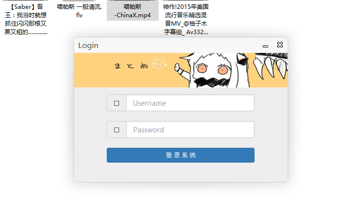
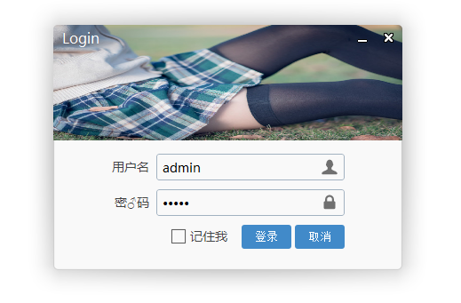

# 介绍
还是没有人发易语言wke透明阴影, 更改窗口尺寸这些. 那么我就来发一个吧， 供大家参考  --- 2016-11-15

示例1：

示例2：

# 实现
> 窗口阴影
阴影是通过wke GDI透明渲染模式 + 一个png阴影图片 + border-image样式做的
> 更改窗口尺寸
更改窗口尺寸, 就是对元素`被鼠标左键按下`事件后做处理, 发送win窗口消息 
> wke浏览框 实现移动窗口位置
拖拽窗口这个之前已经实现了, 这是最基本的. 不然还怎么愉快的玩wke

# 调试
用`易语言5.11` 以上版本打开`login.e` 按f5调试

调试的时候 分别载入两个  login2.html    user-login.html  就好了.   

关于那个bootstrap无法显示 "字体图标" 主要是不完整. 完整版有几个字体文件的. 下载完整版就没问题了